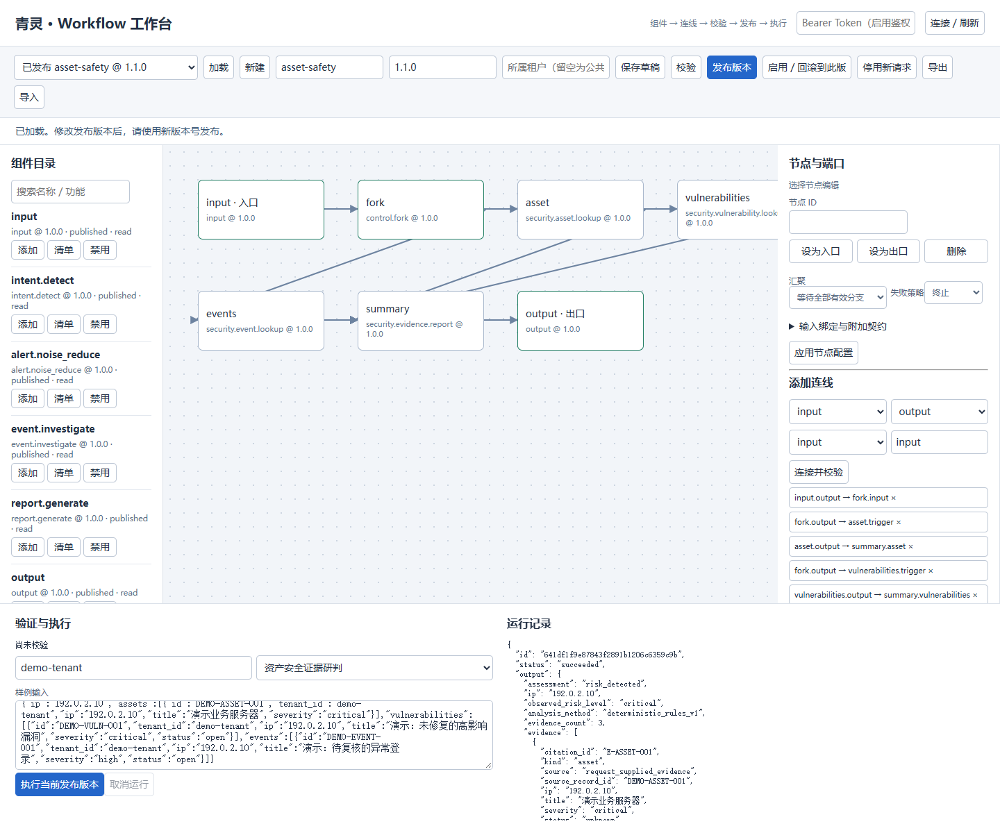

# 青灵智能体

**可追溯、可审批的安全研判工作台（本地演示版）。** 一个可复现的案例是：对目标资产汇集请求提供的资产、漏洞和事件记录，生成带证据引用的报告；证据不足时保留结论。另有高风险处置的审批 / 拒绝分支，**演示处置只返回 dry-run，不会真实封禁**。

> 示例数据是合成输入，`asset-safety@1.1.0` 的报告使用确定性规则，不是实时扫描、真实模型测评或检测准确率证明。不要输入未获授权的真实安全事件。

## 几分钟内运行

在项目根目录（Windows PowerShell）：

```powershell
python -m venv .venv
& .\.venv\Scripts\python.exe -m pip install -c requirements/constraints.txt -e '.[dev]'
& .\.venv\Scripts\python.exe -m app
```

打开 `http://127.0.0.1:8000/workbench`（工作台）、`http://127.0.0.1:8000/health`（健康检查）或 `/docs`（API）。默认是内存存储、只监听 `127.0.0.1`；退出后内存数据消失。工作台中选择已发布的 `asset-safety@1.1.0`、Profile `asset-investigation`，用合成输入运行后查看 Run 轨迹和报告。[工作台操作说明](docs/Workflow工作台使用说明.md) 中的旧版本示例不代表新版本报告效果。

需要本地 SQLite 时可运行 `./scripts/start-workbench.ps1`（默认 `8010` 端口和 `data/workbench.db`）。请使用新的本地数据库演示，不要清空已有数据库；已有数据库中存在 Profile 时，启动过程不会自动导入后来新增的默认 Profile / Workflow。

## 离线验收：9 个案例

```powershell
& .\.venv\Scripts\python.exe -m app.demo --output artifacts/demo.json
& .\.venv\Scripts\python.exe -m pytest -q -o addopts='' -p no:cacheprovider
& .\.venv\Scripts\python.exe -m ruff check app tests scripts
```

`app.demo` 在进程内调用真实 FastAPI 路由，使用临时内存、合成数据和确定性离线网关，不开放网络监听，也不使用用户数据库。它检查六个证据情景，以及跨租户 Run 读取拒绝、审批后 dry-run、拒绝后不执行。本地复核（Windows / Python 3.13）为 **9/9**，测试 **150 passed**，基础 lint 通过；本地 `artifacts/` 已忽略，输出不是产品指标。Ruff 仅启用 E9/F63/F7/F82 基础正确性规则。

GitHub Actions 已配置 Linux / Windows 与 Python 3.10 / 3.13 矩阵。首次远程 CI 的 Windows / Python 3.13 wheel 烟雾测试曾出现审批决策失败，随后诊断版矩阵通过。本补丁修复了可确定性复现的 UUID 引用被手机号脱敏、审批请求因此返回 HTTP 404 的缺陷；首次 CI 未记录 HTTP 状态，不能事后断言其原因相同。本补丁的远端结果以新提交的 Actions 为准。

从本次 `artifacts/demo.json` 的 `sample_report` 摘录：

```text
目标：192.0.2.10
结论：risk_detected；已观察风险：critical；分析方式：deterministic_rules_v1
F-001 [critical] 演示：未修复的高影响漏洞（引用 E-VULNERABILITIES-001；待核实）
F-002 [high] 演示：待复核的异常登录（引用 E-EVENTS-001；待核实）
限制：来源真实性、数据新鲜度和覆盖率均未校验；不是自动处置授权。
```

报告中发现的 `evidence_ids` 可在证据索引中解析；`risk_detected` 概括**输入中的有效风险记录**，不证明攻击已发生。缺数据不代表安全。



截图取自本地内存演示：合成输入、确定性规则、无真实模型调用或处置。

## 结构与资源

```text
浏览器 / API
    ↓
FastAPI（app/main.py、工作台）
    ↓
Runtime（Run 状态、审批、审计、租户边界）
    ├── Workflow → 组件注册与证据报告
    ├── ReAct / PromptChain → 模型和受控工具适配器
    └── 内存或本地 SQLite 存储
```

默认 Profile / Workflow JSON 位于 `app/resources/config/`，默认 Skill 位于 `app/resources/skills/`，合成案例位于 `app/resources/examples/`；这些随包安装。根目录 `config/mcp_servers.example.json` 仅是 MCP 配置模板。覆盖资源的说明见 [config/README.md](config/README.md)。当前使用说明请从 [文档索引](docs/README.md) 进入。

## 安全边界

- 默认无认证**仅供本机演示**。`python -m app --host` 对非回环地址要求启用认证和配置 token；**直接调用 uvicorn 不经过这一条 CLI 绑定检查**，不能据此安全地对公网开放服务。
- 静态 Bearer token 适配器不等于企业 IAM；本地 SQLite 不等于生产多实例协调或数据治理。认证、租户、审批、工具授权等边界不可为方便演示而关闭或放宽。
- 线程取消依赖组件协作，不保证强杀第三方调用。OpenAI-compatible / HTTP 适配器存在不代表真实模型效果或外部事件源已验证；真实数据、凭据和副作用连接器需要单独授权与评估。
- `.env.example` 是参考清单，应用**不会自动加载 `.env`**；只在本地 shell 设置环境变量，勿提交 token、事件或数据库。详见 [SECURITY.md](SECURITY.md)。

参与方式见 [CONTRIBUTING.md](CONTRIBUTING.md)。本项目由 sillxf 持有版权，按 [MIT License](LICENSE) 授权；第三方依赖仍遵循其各自许可证。
